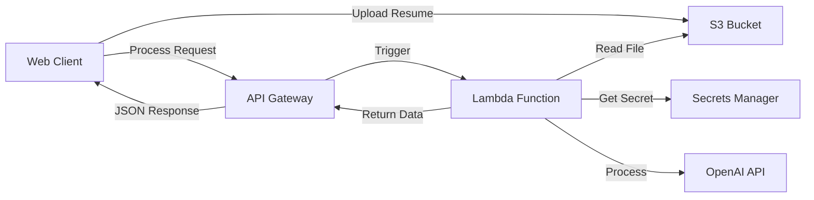
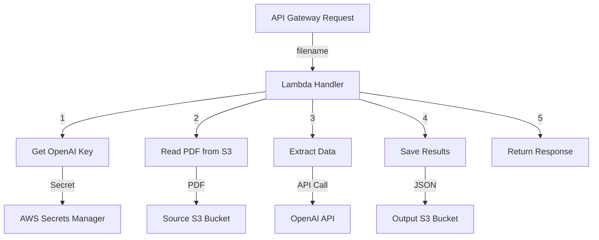

A serverless AI-powered resume parsing solution that leverages AWS services and OpenAI API to automatically extract and structure information from resumes.


## 🏗️ Architecture

## 📝 Easy Usage
- Open the web application
- Select a PDF resume to upload
- Click "Process" to start parsing
- Download the structured JSON data

## 🚀 Features
- PDF resume parsing using AI
- Direct S3 upload from browser
- Serverless architecture
- Real-time processing via API
- Fast upload and download with S3 Transfer Acceleration
- Downloadable JSON results
- Modern UI with TailwindCSS
- [coming soon] Resume Scoring System
- [coming soon] Candidates classification and ranking
- [coming soon] Jobs recommendations

## 🛠️ Technologies Used
- Frontend: HTML5, TailwindCSS, AWS SDK
- Backend:
  - AWS Lambda (Python)
  - Storage: Amazon S3
  - API: Amazon API Gateway (RESTful)
- AI: OpenAI API

## 📋 Prerequisites
- AWS Account
- OpenAI API Key
- Web browser with JavaScript enabled

## ⚙️ Setup and Configuration
### AWS Services Setup
1. Secrets Manager
Store your OpenAI API key securely using AWS Secrets Manager:
```json
{
    "OPENAI_API_KEY": "your-openai-api-key"
}
```

2. S3 Bucket
Create a bucket for storing uploaded files
Enable CORS for browser uploads:
```json
[
    {
        "AllowedHeaders": ["*"],
        "AllowedMethods": ["GET", "PUT", "POST"],
        "AllowedOrigins": ["*"],
        "ExposeHeaders": []
    }
]
```
3. API Gateway
- REST API endpoint: ```/process```
- Method: GET
- CORS enabled

4. Lambda Function

  3.1 🛠️ Creating Lambda Layer for Resume Parser Dependencies (Python 3.10)
  📦 Required Dependencies
  #### Define a requirements.txt
  ```txt
  pydantic==2.9.2
  pydantic-core==2.23.4
  PyMuPDF==1.23.8
  pypdf==3.17.1
  openai==1.12.0
  ```

  #### Create your lambda layer
  ```bash
  # 1. Create a new directory
  mkdir lambda-layer
  cd lambda-layer
  
  # 2. Create python directory structure
  mkdir -p python/lib/python3.10/site-packages
  
  # 3. Install dependencies
  pip3.10 install -r requirements.txt -t python/lib/python3.10/site-packages
  
  # 4. Create ZIP file
  zip -r lambda-layer.zip python/
  ```
  If you have any trouble on lambda, you may have to specify the exact python version and platform&architecture for linux.
  In my case it was : 
  ```
  pip3.10 install -r ../requirements.txt --platform manylinux2014_x86_64 --only-binary=:all: --target aws-layer/python/lib/python3.10/site-packages
  ```
  #### 📤 Publishing the Layer Using AWS CLI
  ```bash
  aws lambda publish-layer-version \
      --layer-name resume-parser-dependencies \
      --description "Dependencies for Resume Parser" \
      --zip-file fileb://lambda-layer.zip \
      --compatible-runtimes python3.10
  ```
  #### 🔗 Adding Layer to Lambda Function Using AWS CLI
  ```bash
  aws lambda update-function-configuration \
      --function-name resume-parser \
      --layers arn:aws:lambda:region:account-id:layer:resume-parser-dependencies:1
  ```

### Required permissions:
- SecretsManagerReadWrite
- S3ReadAccess (or bucket full access)
- CloudWatchLogsFullAccess
- Access Key for html webapp to access AWS resources : it is highly recommended to use a more secure way like AWS Cognito or API Gateway with IAM Authorizer.
  
### 🔒 Security
- AWS credentials managed securely
- OpenAI API key stored in Secrets Manager
- S3 bucket configured with appropriate permissions
- API Gateway with CORS enabled

### 📊 Monitoring
Monitor the application using:
- CloudWatch Logs for Lambda execution
- S3 metrics for storage usage
- API Gateway metrics for requests

### 💰 Cost Considerations
Free Tier Limits:
- S3: 5GB storage, 20K GET, 2K PUT requests
- Lambda: 1M free requests
- API Gateway: 1M calls
- OpenAI API: Separate pricing. You can also use other models for free from [HuggingFace Models](https://huggingface.co/models) 

### 🔄 Future Improvements
- Add user authentication
- Implement batch processing
- Add progress tracking
- Support more file formats
- Add result caching
- Improve error handling

### 📄 License
This project is licensed under the MIT License - see the LICENSE.md file for details
